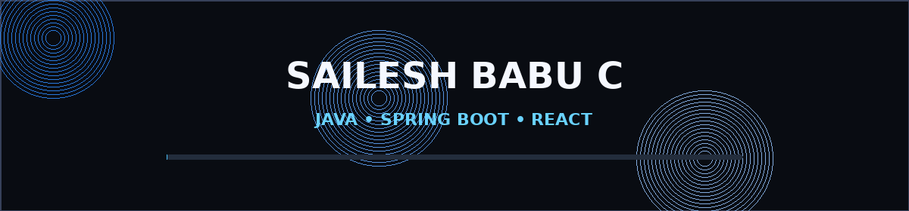

<div align="center">

# 👋 Hi, I'm **Sailesh Babu C**

### `Java Full Stack Developer` · `Software Engineer` · `AI Enthusiast`



<p>
  <a href="https://github.com/postbox1200">
    
  </a>
  <a href="https://www.linkedin.com/">
    
  </a>
  <a href="mailto:YOUR_EMAIL@example.com">
    
  </a>
</p>

</div>

---

## 🚀 About Me

<table>
<tr>
<td width="58%" valign="top">

### 👨‍💻 What I Do

- ☕ Build backend applications with **Java & Spring Boot**
- 🌐 Create full-stack applications with **React, Next.js & TypeScript**
- 🗄️ Design and work with **PostgreSQL, MySQL & SQL**
- 🤖 Explore **LLMs, RAG, AI Agents & MCP**
- ☁️ Learn **Docker, cloud infrastructure & production systems**
- 🧩 Interested in building useful developer tools and SaaS products
- 📍 Based in **Chennai, India**

### 🎯 Current Focus

`Java` → `Spring Boot` → `System Design` → `Cloud` → `AI`

</td>

<td width="42%" align="center">


</td>
</tr>
</table>

---

# 🛠️ Tech Stack & Ecosystem

### 💻 Languages & Frontend

<p>

</p>

### ⚙️ Backend, Database & DevOps

<p>

</p>

### 🤖 AI & Developer Tools

<p>

</p>

---

# 🚀 Featured Projects

<table>
<tr>
<td width="50%" valign="top">

### 🌾 Farmers' E-Market

A digital bridge between farmers and local markets.

**Features**
- 📊 Product price updates
- 🔎 Product search & filtering
- 🤝 Best buyer identification
- 💬 Chat
- 📦 Order processing

**Stack:** React · TypeScript · Supabase · PostgreSQL

</td>

<td width="50%" valign="top">

### 🤖 Infra0

An AI infrastructure copilot that turns natural-language requirements into Terraform infrastructure.

**Focus**
- ☁️ Cloud infrastructure
- 🧠 AI-assisted generation
- 📝 Terraform
- 🛠️ Browser-based developer workflow

**Stack:** Next.js · TypeScript · AI SDK · Terraform

</td>
</tr>

<tr>
<td width="50%" valign="top">

### 📅 Meeting Scheduler

A full-stack scheduling platform with authentication, resource management and smart scheduling.

**Stack:** Next.js · PostgreSQL · Drizzle ORM · OAuth

</td>

<td width="50%" valign="top">

### 🧠 AI Developer Assistant

An AI application exploring modern LLM architecture.

**Exploring**
- RAG
- AI Agents
- MCP
- Streaming
- Database-backed conversations

**Stack:** Next.js · AI SDK · Drizzle · PostgreSQL

</td>
</tr>
</table>

---

# 📊 GitHub Insights

<div align="center">


</div>

<br>

<div align="center">


</div>

---

# 🧠 My Developer Journey

```text
             ┌──────────────────┐
             │      JAVA ☕      │
             └────────┬─────────┘
                      ↓
             ┌──────────────────┐
             │  SPRING BOOT ⚙️  │
             └────────┬─────────┘
                      ↓
             ┌──────────────────┐
             │  FULL STACK 🌐   │
             └────────┬─────────┘
                      ↓
             ┌──────────────────┐
             │   CLOUD ☁️       │
             └────────┬─────────┘
                      ↓
             ┌──────────────────┐
             │   AI / LLM 🤖    │
             └────────┬─────────┘
                      ↓
             ┌──────────────────┐
             │ PRODUCTION 🚀    │
             └──────────────────┘
```

---

# ⚡ Currently Learning

<table>
<tr>
<td>☕ Java & Spring Boot</td>
<td>🏗️ System Design</td>
</tr>
<tr>
<td>🗄️ PostgreSQL & Database Design</td>
<td>🐳 Docker & Cloud</td>
</tr>
<tr>
<td>🤖 LLM / RAG / Agents</td>
<td>🔌 MCP & AI Tooling</td>
</tr>
</table>

---

# 📈 Coding Activity


---

# 🌐 Let's Connect

<div align="center">

<a href="https://github.com/postbox1200">

</a>

<a href="https://www.linkedin.com/">

</a>

<a href="mailto:YOUR_EMAIL@example.com">

</a>

<br><br>

### ✨ Build → Learn → Ship 🚀


</div>

---

<div align="center">

**Thanks for visiting my profile! 👋**

</div>
